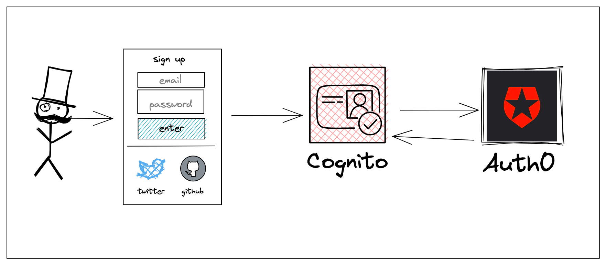

# Amazon Cognito with Auth0 as an OIDC provider

## Overview



This repository showcases how to build an application that allows users to signin with Auth0 and additionally have them captured as an Amazon Cognito user.

The benefits of this approach are that users are able to use authentication methods beyond what Cognito offers out of the box such as GitHub, Twitter, LinkedIn and more. Additionally, since the Auth0 user is captured in a Cognito, they can also take advantage of service-to-service integrations such as calling an AWS AppSync API and, assuming an Identity Pool were to be created, Amazon S3 for storing files.

## Using this stack

The only file needing to change is the [bin file](./bin/auth0-appsync-cdk.ts) that contains the `Auth0Stack`.

```js
const auth0Stack = new Auth0Stack(app, 'Auth0AppsyncCdkStack', {
	userpoolName: 'Auth0Pool',
	domainPrefix: 'auth0-cdk',
	auth0ClientId: 'AUTH0_CLIENT_ID', // get this value from Auth0
	auth0ClientSecret: 'AUTH0_CLIENT_SECRET', // get this value from Auth0
	auth0IssuerUrl: 'https://AUTH0_DOMAIN_NAME.us.auth0.com', // get this value from Auth0
	auth0CallbackUrls: ['http://localhost:3000/'],
	auth0LogoutUrls: ['http://localhost:3000/'],
})
```

## Understanding the stack

TBD

## Useful commands

- `npm run build` compile typescript to js
- `npm run watch` watch for changes and compile
- `npm run test` perform the jest unit tests
- `cdk deploy` deploy this stack to your default AWS account/region
- `cdk diff` compare deployed stack with current state
- `cdk synth` emits the synthesized CloudFormation template
